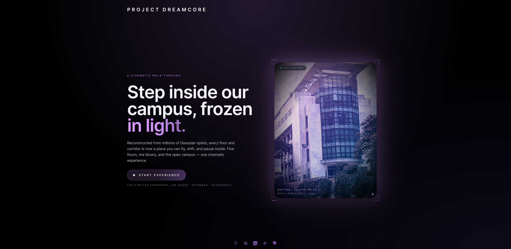

# Project Dreamcore



A cinematic, game-like walk-through of our school campus, reconstructed
from 3D Gaussian Splat captures. Fly, orbit and pause inside every
floor of the building, the library, and the open campus.

## Quick start

```bash
# 1. Install
npm install

# 2. Convert source 3DGS .ply files → web-optimised .splat + manifest
#    (Reads src/assets/scenes/, writes public/assets/scenes/)
npm run scenes

# 3. Dev server
npm run dev

# 4. Production build
npm run build
```

`src/assets/scenes/` and `public/assets/scenes/` are git-ignored — the
former because the source `.ply` files are huge, the latter because the
optimised output is regenerable from source.

## Docs

- [Scenes](_docs/scenes.md) — input formats, conversion pipeline, technical notes
- [Controls](_docs/controls.md) — keyboard, mouse, touch
- [Architecture](_docs/architecture.md) — file layout
